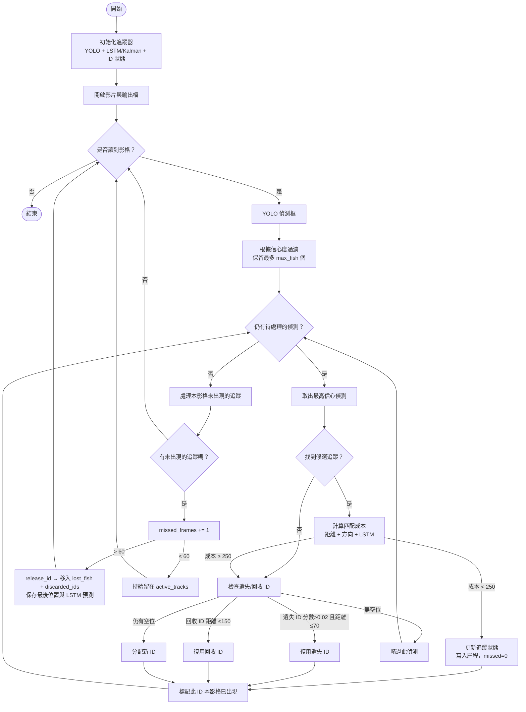

# ObjectTracking 流程概覽

## 主流程與 ID 管理

## 支援邏輯

- **遺失池 (`lost_fish`)**
  - 保存最後位置、最後出現影格，以及最多 15 步的 LSTM/Kalman 預測。
  - 只要 `lost_frames ≤ max_lost_frames (60)` 就仍有機會被復用。
- **回收池 (`discarded_ids`)**
  - 儲存超過遺失視窗或手動移除的 ID。
  - 當新的偵測落在 `discarded_id_reuse_distance = 150` 以內時可以重新啟用。
- **成本組成**
  - 距離權重 `0.85`、方向權重 `0.1`、LSTM 懲罰權重 `0.05`。
  - 距離硬限制 300 像素，LSTM 信心度低於 `0.4` 時額外加罰。

## 目前主要參數

| 參數 | 數值 | 說明 |
|-----------|-------|-------------|
| `max_fish` | 10 | 追蹤同時可用的 ID 數量與新 ID 範圍 |
| `min_detection_confidence` | 0.3 | YOLO 偵測信心門檻 |
| `max_detections` | 10 | 更新追蹤前保留的偵測上限 |
| `distance_threshold` | 300 | 匹配成本中的距離硬限制 |
| `reuse_distance_threshold` | 70 | 復用遺失 ID 的距離門檻 |
| `lstm_prediction_range` | 200 | LSTM 輔助復用考量的半徑 |
| `max_lost_frames` | 60 | 未偵測到仍保留的最大影格數 |
| `reuse_score_threshold` | 0.02 | 遺失 ID 可復用的最低評分 |
| `max_discarded_ids` | 10 | 回收池可保留的 ID 數量 |
| `discarded_id_reuse_distance` | 150 | 回收 ID 可復用的距離限制 |
| `distance_weight` | 0.85 | 空間距離成本權重 |
| `direction_weight` | 0.1 | 運動方向一致性權重 |
| `prediction_weight` | 0.05 | LSTM 懲罰權重 |

> 想了解更詳盡的實作，請參考 `object_tracking.py` 與 `lstm_kalman_tracker.py`。

